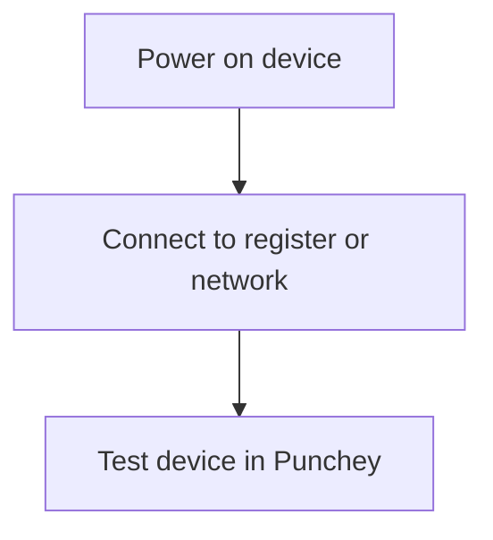

## Understanding supported devices

Punchey works with a range of common point-of-sale hardware. You can combine any of these devices to fit your checkout setup:

- Chip and contactless card readers for secure in‑person payments  
- Magstripe readers for basic swipe transactions  
- Registers for taking payments and managing your front counter  
- Receipt printers for customer copies and order tickets

These devices plug into your setup through Bluetooth, USB, or a local network, depending on the model you use.

<Callout kind="info">

For step‑by‑step setup instructions with photos, visit the Devices and Readers section of our Resource Center:  
[https://support.punchey.com/devices-and-readers](https://support.punchey.com/devices-and-readers)

</Callout>

## How device connections work

Each device type connects in a simple, predictable way. The exact steps vary by model, but the overall flow remains the same.

### General setup flow

<Steps>
  <Step title="Unbox and power on" icon="power">

  
Make sure your device is fully powered and, if required, charged before starting any setup tasks.

  
  </Step>

  <Step title="Connect the device" icon="settings">

  
Most devices pair over Bluetooth or connect to a local network. Follow your hardware guide to complete the pairing process.

  
  </Step>

  <Step title="Run a quick test" icon="check-circle">

  
Open your Punchey register and trigger a test action, such as a test print or a dummy card tap, to confirm everything is working.

  
  </Step>
</Steps>

## What to do if something is not working

Most issues come down to connectivity. Try checking:

- The device has power  
- Bluetooth or network settings are enabled  
- Cables are firmly connected  

If the device still does not respond, the Resource Center includes detailed troubleshooting steps for each specific model.

<Callout kind="tip">

You do not need technical experience. Each hardware guide includes photos and simple instructions designed for everyday users.

</Callout>

## Learn more

Visit the Resource Center for model‑specific setup and troubleshooting guides:

[https://support.punchey.com/devices-and-readers](https://support.punchey.com/devices-and-readers)