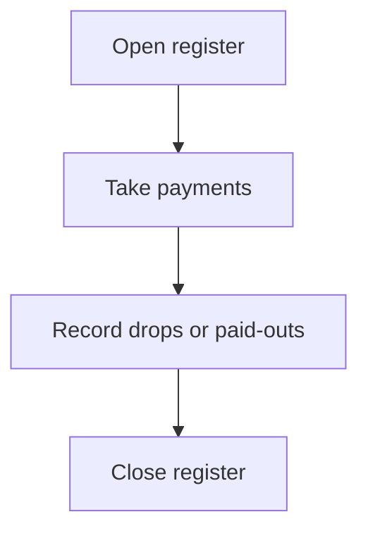

## What register management is

Register management adds structure to in‑person checkout operations. A register session tracks activity for a single cash drawer or checkout station over part of a day.

Punchey uses register sessions to create a clear chain between:

- Individual transactions at the front desk.
- Cash drawer movements such as drops and paid‑outs.
- End‑of‑day reporting and reconciliation.

This mirrors the conceptual flow described in [How Money Moves with Punchey](/money-flow).

## What happens in a register session

A session generally includes three phases:

### Opening the register

- You confirm the starting cash in the drawer.
- Punchey uses this amount as the baseline for the day.
- Staff and managers can verify that the drawer begins with the correct float.

### Operating the register during the day

- Every in‑person payment updates the session totals.
- Cash, card, and mixed‑tender transactions all roll into the same session summary.
- Drops and paid‑outs document when cash is removed for safety or used for store needs. Recording these movements protects staff and simplifies reconciliation later.
- Mobile registers can be used for off‑site or field work when you need a separate session away from your main location.

### Closing the register

- You count the drawer and compare it against the session’s expected totals.
- Differences are highlighted so you can resolve issues before they affect end‑of‑day reports.
- Closing also locks the session, which supports security, cash control, and accurate reporting.

<Callout kind="info">

For detailed, step‑by‑step workflows (opening, drops, paid‑outs, closing), see the **Register Management (Open and Close)** folder in the Punchey Help Center.

</Callout>

## How registers relate to your devices

Register sessions sit between your hardware and your transaction history.

### Cash drawers

- Each drawer corresponds to one register session.
- Staff should never share a drawer without recording a session switch, because it changes who is accountable for the funds.

### Card terminals and SignPad

- Chip, tap, and swipe transactions from your terminals automatically post into the active register session.
- When using SignPad, signatures and on‑screen confirmations are captured but the payment still lands in the correct session.

### Mobile registers

- Field teams or mobile staff can open a separate session on their device.
- This keeps off‑site cash and card activity separate from the main front‑desk drawer.

## Why consistent register habits matter

Good register hygiene protects your business and helps your team:

- Accurate reconciliation  
  Opening and closing sessions ensure your drawer counts match your transaction totals.

- Security and accountability  
  Drops and paid‑outs create an audit trail so managers can see when and why cash moved.

- Reliable reporting  
  Sessions flow directly into [Reports](/reports), giving managers clear summaries of cash, card, and adjustments per location or employee.

- Clear staffing and location controls  
  Register activity links closely with team roles and checkout points. For more on staff permissions and station setup, see [Team & Locations](/team-and-locations).

## Related guides

Use these pages to understand how registers fit into the rest of your in‑person payment environment:

<Columns cols={3}>

<Card
  title="Payment Solutions"
  href="/payment-solutions"
  icon="package"
>

Learn how Punchey accepts cash, card, and remote payments.

</Card>

<Card
  title="How Money Moves with Punchey"
  href="/money-flow"
  icon="box"
>

Follow the flow from transaction to bank deposit.

</Card>

<Card
  title="Devices & Readers"
  href="/devices-and-readers"
  icon="cpu"
>

See how terminals and readers connect to your checkout workflow.

</Card>

<Card
  title="Team & Locations"
  href="/team-and-locations"
  icon="users"
>

Understand staffing, permissions, and checkout stations.

</Card>

<Card
  title="Reports"
  href="/reports"
  icon="clock"
>

Review sales, register summaries, and reconciliation data.

</Card>

</Columns>

## Where to go next

For full UI instructions, button locations, and troubleshooting, use the **Register Management (Open and Close)** folder in the Punchey Help Center. This conceptual page gives you the mental model; the Help Center provides the click‑by‑click steps.
